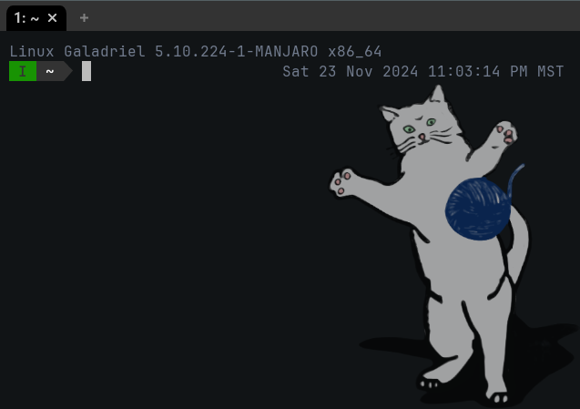

# Catpack parser for wezterm.



Adds support for Prism Launcher's [CatPack](https://prismlauncher.org/wiki/getting-started/catpacks/) format to the [WezTerm terminal emulator](https://wezfurlong.org/wezterm/index.html).

Supports Prismlauncher 9.0 catpack features.

## Dependencies
- [RXI's json.lua library](https://github.com/rxi/json.lua)
- being on a UNIX system

## Usage

Place **catpacks.lua** in wezterm's Lua require path, and require it. Ensure **[rxi/json.lua](https://github.com/rxi/json.lua)** is also in the path. Register an event listener for wezterm's "window-resized" event where the cat image will be automatically resized and added to your background.

If you're doing a lot of configuration editing and want to more easily see the changes, you can also do the same for the "window-config-reloaded" event.

Note that you should have at least one layer already defined in your config if you want a background which isn't mostly transparent.

### Functions + Variables
- catpacks.maximum_window_percentage : float (0-1)

Determines how much of the vertical wezterm window height at most can be occupied by the cat images. Setting this below 1.0 helps prevent cats from being cut off by the tab bar. Default: 0.8

- catpacks.kitty_opacity : float (0-1)

Determines the opacity of the cat image background layer. Setting this below 1.0 can help keep text readable while on top of unfortunately colored images. Default: 0.6

- catpacks.draw_cat : bool

If set to false, freshly calculated kitties will always have an opacity of 0. Combined with **catpacks.toggle_cats**, this can be used to hide the cat layer until a key combination is pressed. Default: true

- catpacks.add_kitty(window, config, filepath, index)

Add an image as layer `index` in config.background, scaled and positioned like the MultiMC cat.
If `index` is not provided, the cat layer is placed on top.

- catpacks.add_from_pack(window, config, catpack, index)

Automatically set the appropriate image from the catpack folder `catpack` for the current date.
If `index` is not provided, the cat layer is placed on top.

- catpacks.toggle_cats(win, pane)

A [wezterm action callback](https://wezfurlong.org/wezterm/config/lua/wezterm/action_callback.html) which toggles cat rendering. By binding this to a key, you can turn the cats on and off. Much like Prism Launcher's cat button, this will reroll randomly selected cats.

### Example Configuration
```lua
local wezterm = require 'wezterm'
local catpacks = require "catpacks"

local config = wezterm.config_builder()
config.color_scheme = 'Abernathy'
local scheme_info = wezterm.color.get_builtin_schemes()[config.color_scheme]

config.background = {
    {
        source = { Color = scheme_info.background },
         height = '120%',
         width = '120%',
         vertical_offset = '-10%',
         horizontal_offset = '-10%',
    },
}

config.keys = {
    {
      mods = 'CTRL|SHIFT',
      key = 'k',
      action = catpacks.toggle_cats
    },
  }

wezterm.on('window-resized', function(window, pane)
	catpacks.add_from_pack(window, config, "multimc_cat")
end)

return config
```
